1. 进入洛谷网校（http://class.luogu.com.cn）

2. 点击右上角的头像进行登陆操作。  
  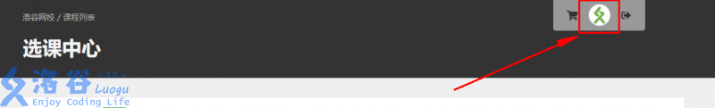  

3. 点击右边选课，进入选课界面。  
  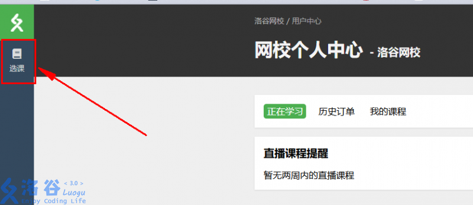  

4. 在选课列表中找到自己要了解的课程，点击图片进入该课程。  
  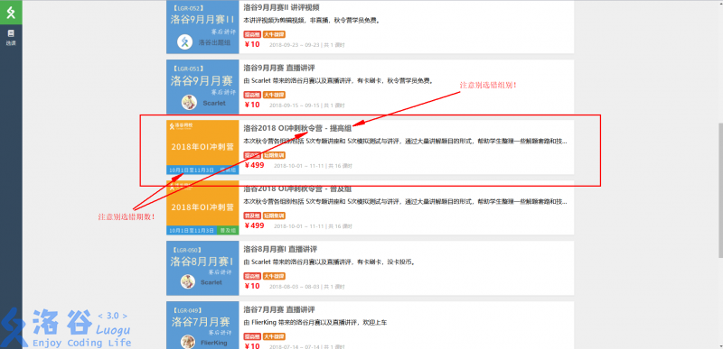  

5. 阅读下方注意事项及提示内容。（极其重要！）  
  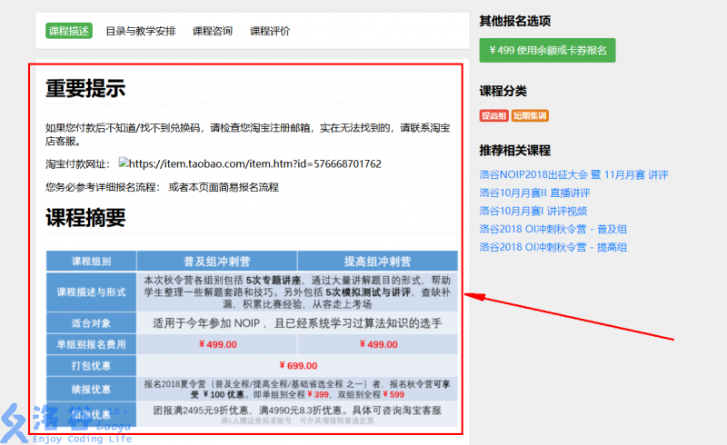  

6. 确认要购买之后，点击上方的加入购物车。
  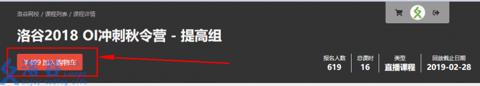  
    

7. 返回选课界面继续选课，重复 4-7 步骤进行操作。
8. 选定全部要购买的课程之后，点击头像旁边的购物车进行结算。
     
  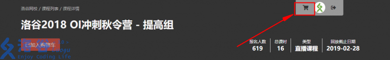 

9. 结算界面中可以看到所选课程，如果有点错的可以去除。  
  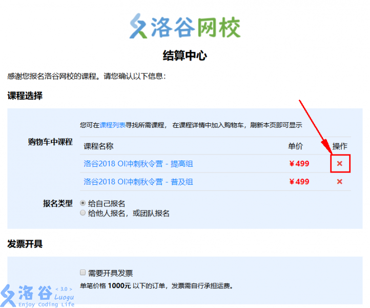  

10. 选择报名类型，若是给他人报名需要按照格式输入报名的用户名称和用户编码。
    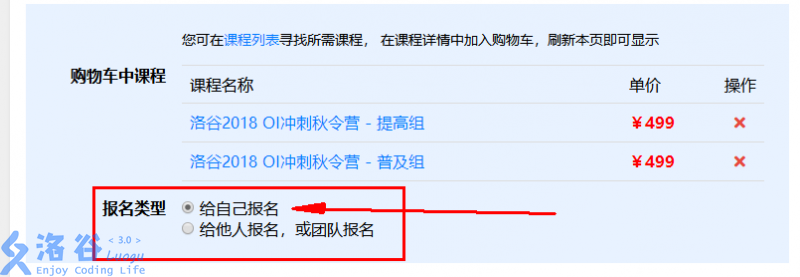 
    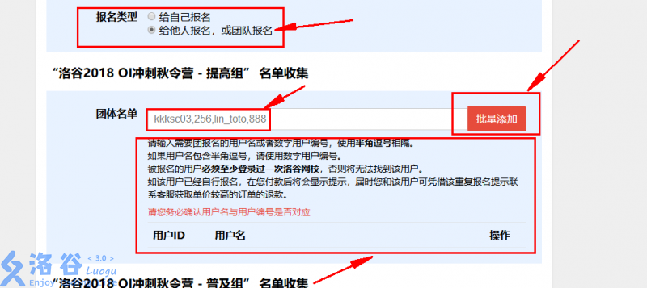 

11. 如果需要开具纸质发票，请点击下方的发票开具并填写发票抬头信息。 
    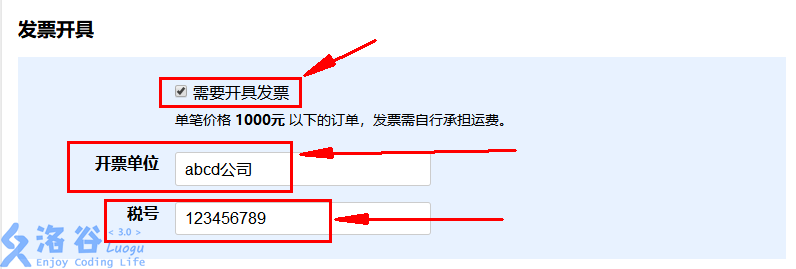   

12. 选填其他留言，没有的话可以留空。  
    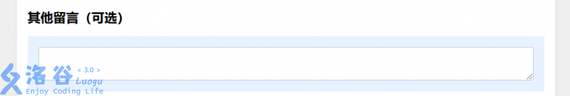 

13. 在最下方了解售后政策并最后核对结算信息，点击确认购买。
    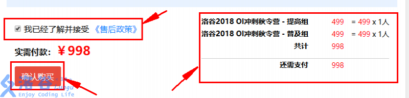 

14. 付款界面，现仅支持支付宝或微信付款。   
    由于该订单低于 1000 元且需要开发票，故需要额外支付 10 元运费（998+10=1008）！具体规定看 11 步骤。  
    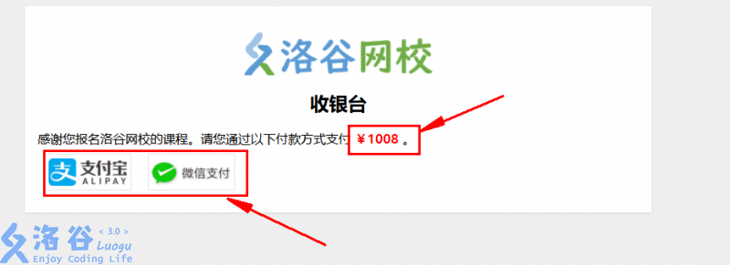 

15. 扫描弹出的二维码，使用对应的渠道进行付款。
    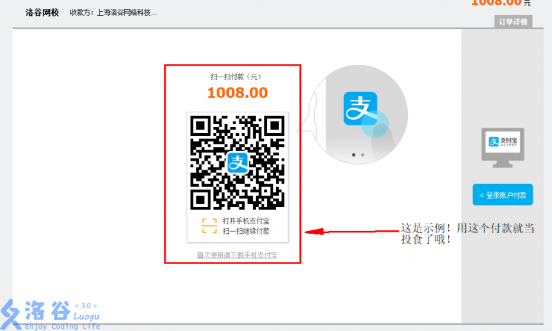 
    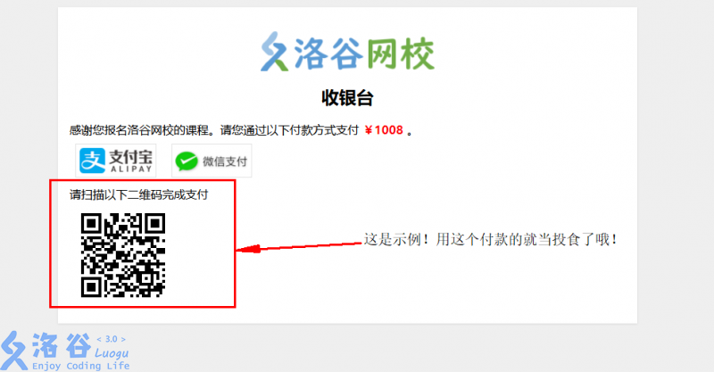 

16. 如果暂时还不想付款，可以点击头像，在历史订单中查看订单并对未付款订单付款。
      **如果订单没有错误，您不需要重新提交订单，只需进行支付即可。**
    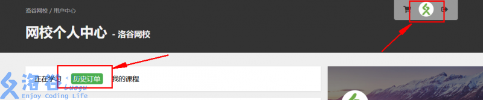   
    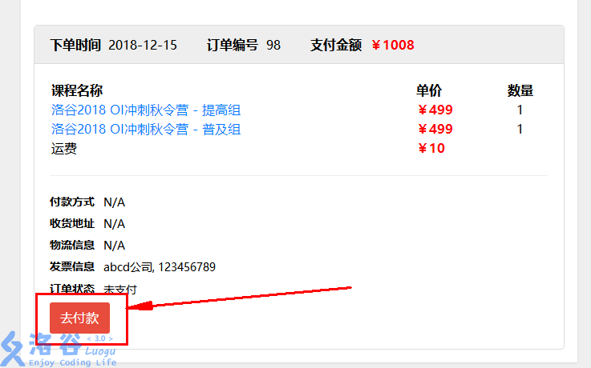 

如果您对网校报名还有任何疑问，可以点击页面右上方的图标咨询。
